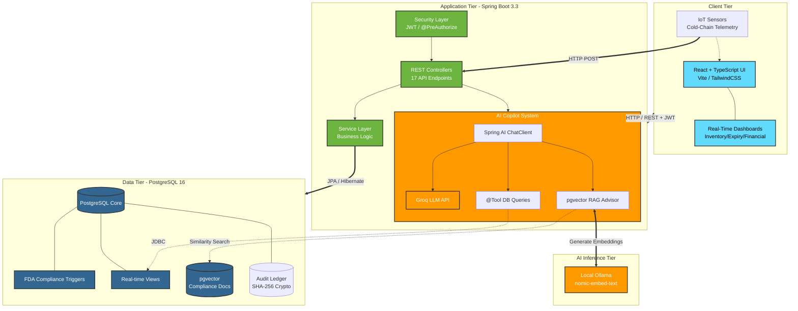
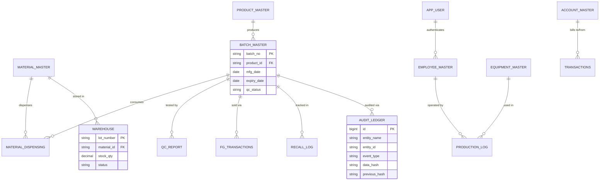
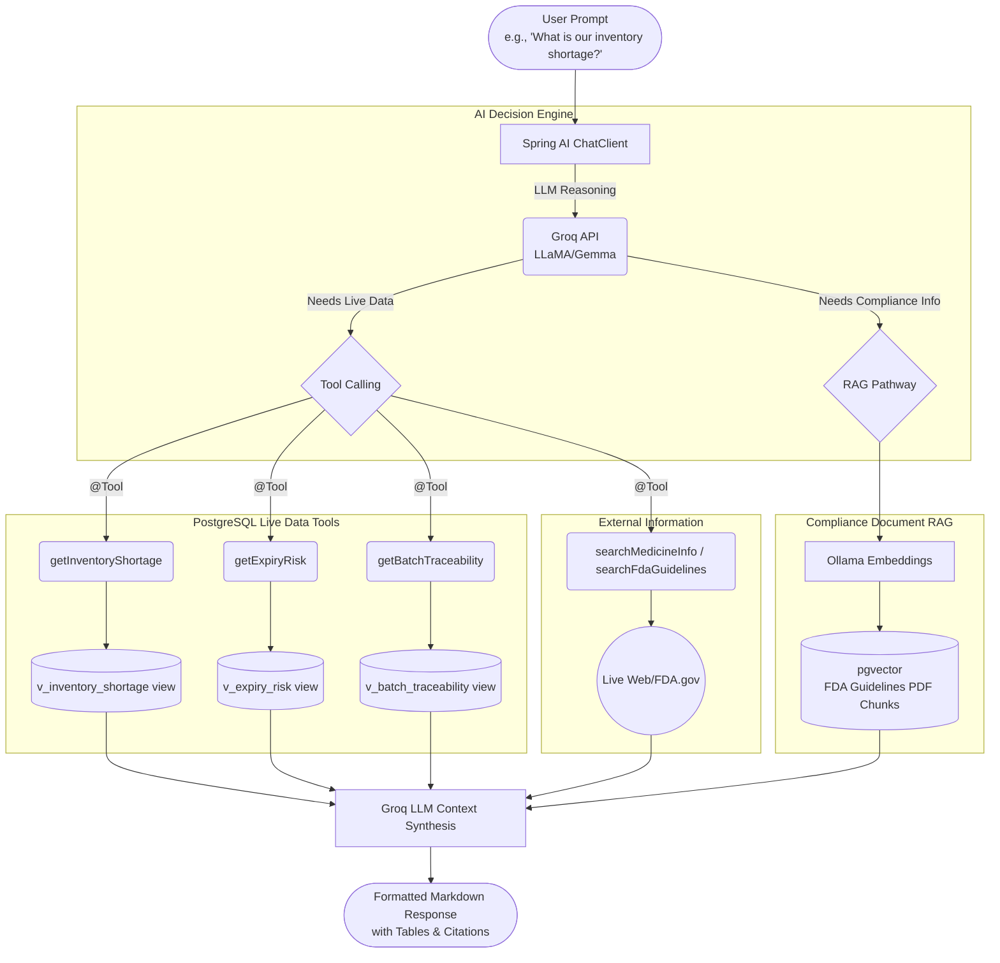

<div align="center">

<h1>💊 PharmaChain</h1>

<p><strong>A Next-Generation Pharmaceutical Supply Chain & Manufacturing Backend</strong></p>

<p>
  
  
  
  
  
  
  
  
</p>

<p><em>Built with Spring Boot, PostgreSQL, and Spring AI</em></p>

</div>

---

## 📋 Table of Contents

- [🌟 The Idea: What is PharmaChain?](#-the-idea-what-is-pharmachain)
- [🏗️ System Architecture](#️-system-architecture)
- [🗄️ Database Schema & Data Flow](#️-database-schema--data-flow)
- [🤖 AI Copilot Architecture](#-ai-copilot-architecture)
- [✨ Core Features](#-core-features)
- [🛠️ Tech Stack](#️-tech-stack)
- [📂 Project Structure](#-project-structure)
- [🚀 Getting Started](#-getting-started)
- [🔐 Demo Accounts](#-demo-accounts)
- [🤖 AI Capabilities Example](#-ai-capabilities-example)

---

## 🌟 The Idea: What is PharmaChain?

PharmaChain is a comprehensive software backend designed for the **Pharmaceutical Manufacturing Industry**. 

In the real world, making medicine is highly regulated by organizations like the FDA. You can't just sell medicine if it hasn't passed Quality Control (QC), and you can't say it was manufactured in the future. 

PharmaChain handles this entire lifecycle:
1. **Procurement**: Buying raw materials.
2. **Manufacturing**: Dispensing those materials to create finished medicine batches.
3. **Quality Control**: Enforcing strict laboratory tests. If a batch fails QC, it **cannot** be sold.
4. **Commerce**: Selling the finished goods to distributors and hospitals.
5. **AI Compliance Copilot**: An intelligent AI assistant built right into the app that can answer questions about live database inventory (e.g., "What is our current shortage?") and explain complex compliance rules using real regulatory documents.

We use **PostgreSQL Database Triggers** to enforce strict FDA-style compliance at the absolute lowest level. The Spring Boot backend acts as a fast, secure, and smart REST API layer on top of this impenetrable database.

---

## 🏗️ System Architecture

PharmaChain follows a robust 3-tier architecture with an embedded AI inference layer, designed for enterprise-grade scalability and strict regulatory compliance.



---

## 🗄️ Database Schema & Data Flow

PharmaChain's database is the core of the system. The real business rules live in PostgreSQL triggers, making them impossible to bypass via the API.



### 🛑 FDA Compliance Database Triggers
1. `trg_deduct_stock_on_dispense`: **BEFORE INSERT** on `Material_Dispensing`. Atomically subtracts stock; raises an exception if stock goes negative.
2. `trg_prevent_sale_without_qc`: **BEFORE INSERT** on `FG_Transactions`. Raises an exception if batch QC status is not 'PASS'.
3. `trg_prevent_future_mfg_date`: **BEFORE INSERT/UPDATE** on `Batch_Master`. Ensures no future manufacturing dates.
4. `trg_set_expiry_date`: **BEFORE INSERT** on `Batch_Master`. Auto-calculates `Expiry_Date` based on product shelf life.
5. `trg_material_qc_auto_update`: **AFTER INSERT** on `QC_Report`. Updates Warehouse lot status to APPROVED/REJECTED based on material tests.

---

## 🤖 AI Copilot Architecture

The AI Copilot uses a **dual-pathway RAG + Tool Calling** architecture. Every question is handled by exactly the right mechanism:



---

## ✨ Core Features

- 🔐 **Role-Based Security (JWT)**: Strict access control. A Warehouse Manager can create batches, but only a QC Analyst can submit lab results.
- 🛑 **Database-Level FDA Compliance**: Triggers ensure you can't sell untested batches, and stock is automatically deducted when manufacturing.
- 🤖 **Spring AI Copilot (RAG + Tools)**: Ask the system natural questions. It reads live database records (using Tool Calling) and compliance PDFs (using pgvector embeddings) to give you accurate answers.
- 📊 **Real-Time Dashboards**: Track expiring batches, inventory shortages, and full traceability trees for any batch.
- 🚨 **Emergency Recalls**: A single SQL stored procedure instantly quarantines a batch and tracks the recall reason.
- 👥 **Staff Directory**: Secure, admin-only dashboard to manage highly-detailed pharmaceutical HR records.
- ❄️ **IoT Cold-Chain Monitoring**: Real-time telemetry endpoints track temperature excursions and automatically trigger batch quarantines if storage conditions violate safe thresholds.
- ⛓️ **Cryptographic Audit Ledger**: An append-only ledger using SHA-256 hashing to cryptographically link and seal critical supply chain events (QA releases, temperature deviations), ensuring immutable data integrity.
- ✍️ **21 CFR Part 11 Compliant E-Signatures**: QA release workflows require explicit supervisor credentials re-authentication, satisfying FDA electronic signature requirements.

---

## 🛠️ Tech Stack

- **Backend:** Java 21, Spring Boot 3, Spring Data JPA, Spring Security (JWT)
- **AI & ML:** Spring AI, Groq (LLM), Ollama (Local Embeddings), pgvector
- **Database:** PostgreSQL 16 (with custom triggers, views, and functions)
- **Frontend:** React, TypeScript, Vite, Tailwind CSS (located in `/frontend`)
- **Infrastructure:** Docker, Docker Compose, GitHub Actions (CI/CD)

---

## 📂 Project Structure

```text
📁 PharmaChain/
├── 📁 db/                           # Database Scripts
│   ├── 📄 01_schema_and_data.sql    # Tables, Triggers, Views, and Seed Data
│   ├── 📄 02_security_schema.sql    # Login/Auth Tables and Demo Accounts
│   ├── 📄 03_1000_medicines.sql     # Seed Data (1000 medicines)
│   ├── 📄 03_fda_compliance_triggers.sql # Additional Triggers
│   ├── 📄 03_staff_expansion.sql    # Staff Directory HR Expansion
│   └── 📄 04_audit_ledger.sql       # Cryptographic Audit Ledger Tables
├── 📁 frontend/                     # React User Interface
│   ├── 📁 src/                      # React Source Code
│   ├── 📄 package.json              # Node Dependencies
│   └── 📄 tailwind.config.js        # Styling Configuration
├── 📁 src/                          # Spring Boot Backend
│   └── 📁 main/
│       ├── 📁 java/com/pharmachain/ # Java Source Code
│       │   ├── 📁 ai/               # 🤖 Spring AI Copilot & Tools
│       │   ├── 📁 controller/       # 🌐 REST API Endpoints
│       │   ├── 📁 entity/           # 📦 Database Models
│       │   ├── 📁 security/         # 🔐 JWT Authentication
│       │   └── 📁 service/          # ⚙️ Business Logic
│       └── 📁 resources/            
│           ├── 📁 compliance-docs/  # 📄 FDA PDFs (Vectorized for AI RAG)
│           └── 📄 application.yml   # Spring Configuration
├── 📄 docker-compose.yml            # Container Orchestration
├── 📄 pom.xml                       # Maven Dependencies
├── 📄 start_backend.ps1             # Windows Script to Start Backend
├── 📄 test_ai.ps1                   # Windows Script to Test AI Copilot
└── 📄 README.md                     # You are here!
```

---

## 🚀 Getting Started

### 1. Prerequisites
- **Java 21** & **Maven 3.9+**
- **Docker** (to run the database)
- **Node.js** (to run the frontend)
- A Groq API Key (for the AI to work)

### 2. Start the Database
Use Docker Compose to spin up the PostgreSQL database (which includes the `pgvector` extension for our AI).
```bash
docker compose up -d
```
Load the schema and seed data:
```bash
psql -h localhost -U postgres -d pharmachain -f db/01_schema_and_data.sql
psql -h localhost -U postgres -d pharmachain -f db/02_security_schema.sql
psql -h localhost -U postgres -d pharmachain -f db/03_staff_expansion.sql
```

### 3. Start the Backend
Set your AI API Key and start Spring Boot:
```bash
export GROQ_API_KEY="your_api_key_here"
mvn spring-boot:run
```
*(Windows users can simply run `.\start_backend.ps1`)*

The backend API will run on `http://localhost:8081`. 

### 4. Start the Frontend
In a new terminal window, navigate to the frontend folder and start the React app:
```bash
cd frontend
npm install
npm run dev
```
Your user interface is now live at `http://localhost:5173`!

---

## 🔐 Demo Accounts

Use these accounts to log into the system and explore different roles:

| Username | Password | Role | Description |
|---|---|---|---|
| `admin` | `Admin@123` | **ADMIN** | Can do everything. |
| `qc.analyst` | `Qc@12345` | **QC_ANALYST** | Submits lab results and handles recalls. |
| `wh.manager` | `Wh@12345` | **WAREHOUSE_MANAGER** | Manages inventory and dispenses materials. |
| `sales.rep` | `Sales@123` | **SALES** | Records sales to hospitals and distributors. |
| `auditor` | `Audit@123` | **AUDITOR** | Strictly Read-Only access. |

---

## 🤖 AI Capabilities Example

Once logged in, try asking the AI Copilot:
> *"What is our current inventory shortage for raw materials?"*

**How it works:**
1. The AI understands your question.
2. It decides it needs real data, so it executes the `getInventoryShortage` Java Tool.
3. The Tool queries the live PostgreSQL View `v_inventory_shortage`.
4. The AI formats the result into a beautiful, human-readable table.

---

<div align="center">
  <i>Built with ❤️ for Modern Pharmaceutical Operations</i>
</div>
